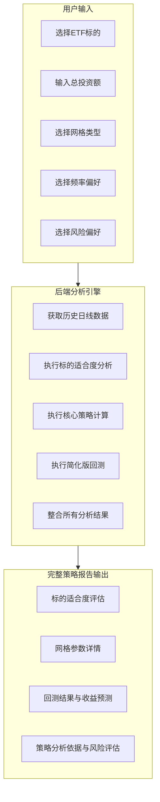

# ETF网格交易策略设计及分析系统 - 产品需求文档

## 项目概述

开发一款基于ETF历史日线数据（OHLCV）的智能网格交易策略设计及分析系统。系统通过分析标的历史数据，结合用户的投资偏好，自动计算最适合的网格交易参数，并提供策略分析依据、收益预测和风险评估。

## 核心功能需求

### 1. 用户输入参数
- **ETF标的选择**: 支持6位数字ETF代码输入
- **总投资资金量**: 用户可输入的投资金额
- **网格间距类型**: 等差网格 / 等比网格
- **交易频率偏好**: 低频 / 中频 / 高频
- **风险偏好**: 保守 / 稳健 / 激进

### 2. 系统分析输出

#### 2.1 ETF基础信息与数据质量
- **ETF基本信息**: 代码、名称、管理公司、当前价格、涨跌幅
- **市场数据**: 成交量、成交额、流动性指标
- **历史信息**: 成立日期、上市日期
- **数据质量评估**: 数据新鲜度、完整性检查、分析可靠性

#### 2.2 标的适合度评估（4维度量化评分）
- **振幅评估（35分）**: 基于ATR算法的价格波动分析
- **波动率评估（30分）**: 年化历史波动率风险收益评估
- **市场特征评估（25分）**: ADX指数趋势震荡分析
- **流动性评估（10分）**: 成交量稳定性和充足性分析
- **综合评分**: 100分制量化评估，明确适合度等级

#### 2.3 网格策略参数（基于ATR算法）
- **价格区间**: 基于ATR动态计算的上下边界
- **网格配置**: 网格数量、步长、类型（等差/等比）
- **资金分配**: 每格投入金额、资金利用率、风险控制
- **交易预测**: 预期交易频次、单笔收益估算

#### 2.4 策略分析依据与收益预测
- **算法优势说明**: ATR算法相比传统方法的优势
- **参数选择逻辑**: 基于历史数据和风险偏好的科学匹配
- **收益预测**: 基于历史回测的收益估算和风险评估
- **调整建议**: 市场环境变化时的策略优化方案

## 系统架构设计

### 整体流程


## 核心算法逻辑

### 0. ATR（平均真实波幅）核心算法

#### ATR算法原理
ATR算法相比传统日振幅计算具有显著优势，能够更准确地反映价格波动特征：

```python
# 真实波幅计算（考虑跳空因素）
TR = max(
    high - low,                    # 当日最高最低价差
    abs(high - close_prev),        # 最高价与前日收盘价差（向上跳空）
    abs(low - close_prev)          # 最低价与前日收盘价差（向下跳空）
)

# ATR = 14天真实波幅移动平均
ATR = TR.rolling(14).mean()

# ATR比率 = ATR / 平均收盘价（标准化处理）
ATR_ratio = ATR / close.rolling(14).mean()
```

#### ATR算法优势
- **跳空处理**: 考虑隔夜跳空对波动的影响
- **动态适应**: 自动适应不同价格水平的标的
- **趋势敏感**: 能够捕捉市场波动模式的变化
- **标准化**: ATR比率便于不同标的间的比较

#### 应用场景
- **价格区间计算**: 替代布林带的静态统计方法
- **网格步长设定**: 基于真实波动确定合理步长
- **交易频次预测**: 预估网格触发的可能性
- **风险评估**: 评估价格突破网格的概率

### 1. 标的适合度评估（4维度量化评分体系，总分100分）

#### 振幅评估（35分）- 基于ATR算法
- **指标**: ATR（平均真实波幅）比率
- **计算方法**:
  ```python
  # 真实波幅计算
  TR = max(
      high - low,                    # 当日最高最低价差
      abs(high - close_prev),        # 最高价与前日收盘价差
      abs(low - close_prev)          # 最低价与前日收盘价差
  )
  
  # ATR比率 = 14天真实波幅移动平均 / 平均收盘价
  ATR_ratio = TR.rolling(14).mean() / close.rolling(14).mean()
  ```
- **评分标准**:
  - ATR比率 ≥ 2.0%: 35分 (振幅充足，交易机会丰富)
  - ATR比率 1.5%-2.0%: 25分 (振幅适中，基本适合)
  - ATR比率 < 1.5%: 0分 (振幅不足，不推荐)

#### 波动率评估（30分）
- **指标**: 年化历史波动率
- **计算**: 每日对数收益率标准差 × sqrt(252)
- **评分标准**:
  - 波动率 15%-40%: 30分 (理想区间，风险收益平衡)
  - 波动率 < 15%: 18分 (波动偏低，收益有限)
  - 波动率 > 40%: 12分 (波动过高，风险较大)

#### 市场特征评估（25分）
- **指标**: 平均动向指数（ADX）+ 价格连续性
- **评分标准**:
  - ADX < 20 (震荡市): 25分 (非常适合网格交易)
  - ADX 20-25 (弱趋势): 18分 (可以进行，需注意风险)
  - ADX > 25 (强趋势): 6分 (不推荐，风险较高)

#### 流动性评估（10分）
- **指标**: 日均成交额 + 成交量稳定性
- **评分标准**:
  - 日均成交额 > 1亿 且成交量稳定: 10分 (流动性充足)
  - 日均成交额 5000万-1亿: 6分 (流动性尚可)
  - 日均成交额 2000万-5000万: 3分 (流动性一般)
  - 日均成交额 < 2000万: 1分 (流动性不足，不推荐)

#### 数据新鲜度评估
- **数据时效性检查**: 
  - 最新数据距今 ≤ 1个交易日: 优秀
  - 最新数据距今 2-3个交易日: 良好  
  - 最新数据距今 > 3个交易日: 需要更新
- **数据完整性检查**: 分析期间内数据缺失率 < 5%
- **数据质量评估**: 异常数据点检测和处理

#### 综合适合度判断
- **总分 ≥ 70分**: 非常适合网格交易
- **总分 60-69分**: 基本适合，需注意风险控制
- **总分 < 60分**: 不推荐进行网格交易
- **致命缺陷**: 任一维度为0分视为存在致命缺陷

### 2. 网格策略参数计算

#### 价格区间确定 - 基于ATR算法
- **数据基础**: 过去1-3年的日线数据（OHLCV）
- **核心算法**: ATR（平均真实波幅）+ 风险偏好调整
- **计算方法**:
  ```python
  # 1. 计算ATR比率
  ATR_ratio = ATR_14day / close_price_avg
  
  # 2. 根据风险偏好确定区间系数
  risk_multiplier = {
      '保守': 1.5,
      '稳健': 2.0, 
      '激进': 2.5
  }
  
  # 3. 计算价格区间
  current_price = latest_close_price
  price_range_ratio = ATR_ratio * risk_multiplier[risk_preference]
  
  price_upper = current_price * (1 + price_range_ratio)
  price_lower = current_price * (1 - price_range_ratio)
  ```
- **ATR优势**: 
  - 考虑跳空因素，比简单振幅更准确
  - 动态适应市场波动特征
  - 避免静态统计方法的滞后性

#### 网格数量/步长计算
- **输入**: 价格区间 [P_low, P_high]
- **网格数量确定**:
  - 低频: N = 20-30
  - 中频: N = 40-60
  - 高频: N = 80-100
- **网格类型计算**:
  - **等差网格**: 
    - 步长 = (P_high - P_low) / N
    - 每格价格 = P_low + i × Step
  - **等比网格**（推荐）:
    - 比率 = (P_high / P_low) ^ (1/N)
    - 每格价格 = P_low × (Ratio ^ i)

#### 智能底仓资金分配策略

##### 底仓设计理念
网格交易中的底仓是风险控制和收益优化的关键要素。底仓不参与网格交易，主要作用是：
- **风险缓冲**: 在价格大幅下跌时提供安全边际
- **收益增强**: 通过持有获得分红和长期增值
- **资金效率**: 平衡风险控制与资金利用率

##### 底仓比例计算算法
```python
def calculate_base_position_ratio(atr_ratio, risk_preference, adx_value, volatility):
    """
    智能底仓比例计算
    """
    # 基础比例（根据风险偏好）
    base_ratios = {
        '保守': 0.35,  # 35%底仓，65%网格
        '稳健': 0.25,  # 25%底仓，75%网格
        '激进': 0.15   # 15%底仓，85%网格
    }
    
    # ATR波动调整（波动越大，底仓比例越高）
    atr_adjustment = min(atr_ratio * 5, 0.15)  # 最大调整15%
    
    # 市场趋势调整（基于ADX指数）
    if adx_value < 20:      # 震荡市
        trend_adjustment = -0.05  # 减少底仓，增加网格资金
    elif adx_value < 25:    # 弱趋势
        trend_adjustment = 0.05   # 适中调整
    else:                   # 强趋势
        trend_adjustment = 0.1    # 增加底仓比例
    
    # 波动率调整
    if volatility > 0.4:    # 高波动
        volatility_adjustment = 0.05
    elif volatility < 0.15: # 低波动
        volatility_adjustment = -0.05
    else:                   # 正常波动
        volatility_adjustment = 0
    
    # 计算最终底仓比例
    final_ratio = (base_ratios[risk_preference] + 
                  atr_adjustment + 
                  trend_adjustment + 
                  volatility_adjustment)
    
    # 限制在10%-50%之间
    final_ratio = max(0.1, min(0.5, final_ratio))
    
    return final_ratio
```

##### 资金分配策略类型

**保守型配置（适合新手投资者）：**
- 底仓比例：30-40%
- 网格资金：60-70%
- 特点：风险较低，有充足资金应对市场下跌
- 适用场景：市场不确定性较高，投资经验不足

**稳健型配置（适合大多数投资者）：**
- 底仓比例：20-30%
- 网格资金：70-80%
- 特点：平衡风险与收益，资金利用率适中
- 适用场景：正常市场环境，有一定投资经验

**激进型配置（适合经验丰富者）：**
- 底仓比例：10-20%
- 网格资金：80-90%
- 特点：资金利用率高，追求最大收益
- 适用场景：震荡市场，投资经验丰富

##### 动态调整机制

**触发调整条件：**
- 价格跌破网格下边界超过10%
- ATR值较前期变化超过20%
- ADX指数发生趋势/震荡转换
- 持仓时间超过6个月

**调整策略：**
- 价格大幅下跌：考虑将部分网格资金转为底仓
- 震荡加剧：适当减少底仓比例，增加网格密度
- 趋势明确：增加底仓比例，减少网格交易频率

#### 网格资金分配计算

##### 资金分配逻辑
```python
def calculate_fund_allocation(total_capital, base_position_ratio, grid_count, price_levels):
    """
    智能资金分配计算
    """
    # 1. 底仓资金计算
    base_position_amount = total_capital * base_position_ratio
    
    # 2. 网格交易资金
    grid_trading_amount = total_capital - base_position_amount
    
    # 3. 预留机动资金（5%）
    reserve_amount = total_capital * 0.05
    available_grid_amount = grid_trading_amount - reserve_amount
    
    # 4. 每格资金分配（考虑价格权重）
    grid_funds = []
    total_weight = sum(1/price for price in price_levels)  # 价格越低权重越高
    
    for i, price in enumerate(price_levels):
        weight = (1/price) / total_weight
        grid_fund = available_grid_amount * weight
        shares = int(grid_fund / price)  # 向下取整
        actual_fund = shares * price
        grid_funds.append({
            'level': i,
            'price': price,
            'allocated_fund': grid_fund,
            'shares': shares,
            'actual_fund': actual_fund
        })
    
    return {
        'base_position_amount': base_position_amount,
        'grid_trading_amount': available_grid_amount,
        'reserve_amount': reserve_amount,
        'grid_funds': grid_funds,
        'total_utilization': sum(gf['actual_fund'] for gf in grid_funds) / total_capital
    }
```

### 3. 策略回测（快速原型版本）

#### 回测逻辑
- 遍历历史日线数据，模拟交易过程
- 价格跌破网格点时执行买入操作
- 价格突破网格点时执行卖出操作（需有对应低价位仓位）
- 记录每笔交易、利润、持仓、资金变化

#### 简化假设
- 使用日线数据进行估算
- 采用相对保守的触发假设
- 明确告知用户"基于日线数据估算，可能与实际有差异"

## 技术栈规范

### 前端技术栈
- **框架**: React 18.2.0 + Vite 5.0.8
- **路由**: React Router DOM 7.9.1
- **样式**: Tailwind CSS 3.3.6
- **图表**: Recharts 2.8.0
- **图标**: Lucide React 0.294.0
- **HTTP客户端**: Axios 1.6.0
- **工具库**: clsx 2.0.0

### 后端技术栈
- **框架**: Flask (Python)
- **跨域**: Flask-CORS
- **数据源**: Tushare (金融数据接口)
- **缓存**: 自定义缓存系统
- **环境配置**: python-dotenv

### UI设计规范
- **主色调**: 蓝色系 (#3b82f6)
- **辅助色**: 绿色(成功)、黄色(警告)、红色(危险)
- **价格、盈亏色**: 红涨绿跌原则
- **字体**: Inter字体
- **动画**: 淡入淡出和滑动效果

## 用户体验功能

### 1. 智能ETF选择
- **热门ETF预设列表**: 15个主流ETF快速选择
- **历史记录**: 最近使用的ETF记录

### 2. 表单数据持久化
- **自动保存**: 使用localStorage保存用户输入
- **数据恢复**: 页面刷新后自动恢复数据
- **预设方案**: 
  - 新手友好型: 保守风险 + 低频交易 + 等差网格
  - 稳健增长型: 稳健风险 + 中频交易 + 等比网格
  - 积极进取型: 激进风险 + 高频交易 + 等比网格

### 3. 预设资金选项
- 快速选择: 10万、20万、50万、100万等常用金额
- 自定义输入: 支持任意金额输入

### 4. 报告分享功能
- **分享链接**: 生成唯一分享URL

### 5. 交互体验优化
- **加载状态**: 骨架屏 + 进度条 + 预估时间
- **错误处理**: 友好错误提示 + 重试机制
- **响应式设计**: 完美适配移动端
- **无障碍支持**: 键盘导航 + 屏幕阅读器支持

## 输出报告格式

### 完整策略报告结构
```
ETF网格交易策略分析报告: [ETF代码] [ETF名称]

第一部分：ETF基础信息与数据质量
├── 基本信息: 代码、名称、管理公司、当前价格
├── 市场表现: 涨跌幅、成交量、成交额
├── 历史信息: 成立日期、上市日期
└── 数据质量评估: 数据新鲜度、完整性、分析时间范围

第二部分：标的适合度评估 (总分100分)
├── 振幅评估: XX分/35分 - 基于ATR的日均振幅分析
├── 波动率评估: XX分/30分 - 年化波动率XX%，风险收益评估  
├── 市场特征评估: XX分/25分 - ADX指数XX，当前处于"震荡/趋势"状态
├── 流动性评估: XX分/10分 - 日均成交额XXX，成交量稳定性分析
└── 综合结论: 总分XX分，该标的[非常适合/基本适合/不适合]执行网格交易策略

第三部分：为您定制的网格策略 (基于ATR算法)
├── 目标设置: 风险偏好XX，总投资资金￥XXX,XXX
├── 价格区间: ￥X.XX - ￥X.XX (基于ATR计算，区间比例XX%)
├── 网格配置: XX个网格，网格类型[等差/等比]
├── 网格步长: ￥X.XXX (步长比例X.X%)
├── 资金分配: 底仓资金量、每格投入￥X,XXX，预期单笔收益￥XXX
└── 资金利用: 最大持仓￥XX,XXX，资金利用率XX%

第四部分：历史回测表现与收益预测
├── 回测时间段: YYYY-MM-DD 至 YYYY-MM-DD
├── 交易频次: 预期日交易X.X次，月交易XX次
├── 收益预测: 预期月收益￥X,XXX (收益率X.X%)
├── 风险指标: 最大回撤预估X.X%，夏普比率X.X
└── 年化收益: 预估年化收益率XX%

第五部分：策略分析依据与调整建议
├── ATR算法优势: 动态适应市场波动，考虑跳空因素
├── 参数选择逻辑: 基于历史数据统计和风险偏好匹配
├── 市场环境应对: 波动率变化时的参数调整建议
├── 风险控制建议: 强趋势环境下的应对策略
└── 优化建议: 资金效率改进和目标收益率调整

第六部分：风险提示与重要声明
├── 数据基础说明: 基于历史日线数据分析，实际效果可能有差异
├── 市场风险: 价格突破网格区间的应对方案
├── 流动性风险: 成交量不足时的交易影响
└── 免责声明: 本分析仅供参考，不构成投资建议，投资有风险
```

## 数据可视化需求

### 图表类型
- **价格走势图**: 标注网格线和理论买卖点
- **收益曲线图**: 策略收益 vs 基准收益对比
- **风险收益散点图**: 不同参数组合的效果分布
- **交易频次柱状图**: 各价格区间的交易次数分布

### 交互功能
- **图表缩放**: 支持时间范围选择
- **悬停详情**: 显示具体数值和说明
- **图例切换**: 可选择显示/隐藏不同数据系列

## 性能和缓存策略

### 缓存机制
- **参数缓存**: 对tushare接口相同输入参数的结果按请求参数本地缓存
- **用户缓存**: 个人配置浏览器本地存储

### 性能优化
- **懒加载**: 图表和复杂计算按需加载
- **分页处理**: 大量历史数据分批处理

## 错误处理和边界情况

### 数据异常处理
- **数据缺失**: 提示用户选择其他标的或时间范围
- **API限流**: 实现重试机制和降级方案
- **计算异常**: 提供默认参数和人工干预选项

### 用户输入验证
- **资金范围**: 最小10万，最大500万
- **ETF代码**: 验证格式和有效性
- **参数组合**: 检查参数合理性并给出建议

## 未来扩展规划

### 短期优化（1-3个月）
- 引入分钟线数据提升回测精度
- 添加多ETF组合策略分析
- 实现实时价格监控和提醒

### 中期发展（3-6个月）
- 支持股票、可转债等其他标的
- 添加机器学习优化算法
- 开发移动端APP

### 长期愿景（6-12个月）
- 接入券商API实现自动交易
- 构建用户社区和策略分享平台
- 提供专业投顾服务

---

**重要声明**: 本系统仅供投资参考，不构成投资建议。投资有风险，入市需谨慎。历史数据不代表未来表现。