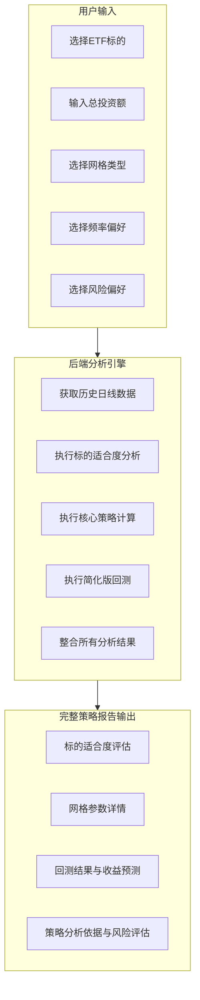

# ETF网格交易策略分析系统 - 产品需求文档

## 项目概述

开发一款基于ETF历史日线数据（OHLCV）的智能网格交易策略分析系统。系统通过分析标的历史数据，结合用户的投资偏好，自动计算最适合的网格交易参数，并提供策略分析依据、收益预测和风险评估。

## 核心功能需求

### 1. 用户输入参数
- **ETF标的选择**: 支持代码输入和名称搜索
- **总投资资金量**: 用户可输入的投资金额
- **网格间距类型**: 等差网格 / 等比网格
- **交易频率偏好**: 低频 / 中频 / 高频
- **风险偏好**: 保守 / 稳健 / 激进

### 2. 系统分析输出
- **标的适合度评估**: 基于流动性、波动率、振幅、趋势等维度
- **网格策略参数**: 网格步长、资金分配、价格区间等关键数据
- **策略分析依据**: 参数选择的逻辑说明
- **收益预测**: 基于历史回测的收益估算
- **风险评估**: 最大回撤、夏普比率等风险指标

## 系统架构设计

### 整体流程


## 核心算法逻辑

### 1. 标的适合度评估

#### 流动性分析
- **指标**: 日均成交额
- **计算**: 过去一年（约250个交易日）的日均成交额
- **评估标准**:
  - 高流动性: 日均成交额 > 1亿 (非常适合)
  - 中等流动性: 1000万 < 日均成交额 < 1亿 (基本适合)
  - 低流动性: 日均成交额 < 1000万 (不推荐，警告用户)

#### 波动率与振幅分析
- **指标**: 年化历史波动率 和 平均真实波幅（ATR）
- **计算**:
  - 历史波动率: 每日对数收益率标准差 × sqrt(252)
  - ATR: 14天真实波幅的平均值
- **评估标准**:
  - 理想状态: 年化波动率在20%-50%之间
  - 波动过低: 交易次数少，资金利用率低
  - 波动过高: 风险巨大，可能频繁击穿网格

#### 趋势分析
- **指标**: 平均动向指数（ADX）
- **评估标准**:
  - ADX < 20: 震荡市，非常适合网格交易
  - 20 < ADX < 25: 趋势开始形成，可以进行但需注意风险
  - ADX > 25: 强趋势市，警告用户风险较高

### 2. 网格策略参数计算

#### 价格区间确定
- **数据基础**: 过去1-3年的日线数据（OHLCV）
- **计算方法**: 使用布林带统计学方法
  - 计算过去一年的20日或30日均线（MA）及其标准差（STD）
  - **保守型**: 价格区间 = MA ± 1.5 × STD
  - **稳健型**: 价格区间 = MA ± 2.0 × STD
  - **激进型**: 价格区间 = MA ± 2.5 × STD

#### 网格数量/步长计算
- **输入**: 价格区间 [P_low, P_high]
- **网格数量确定**:
  - 低频: N = 20-30
  - 中频: N = 40-60
  - 高频: N = 80-100
- **网格类型计算**:
  - **等差网格**: 
    - 步长 = (P_high - P_low) / N
    - 每格价格 = P_low + i × Step
  - **等比网格**（推荐）:
    - 比率 = (P_high / P_low) ^ (1/N)
    - 每格价格 = P_low × (Ratio ^ i)

#### 资金分配
- **输入**: 总投资资金 Total_Capital，网格数量 N
- **计算逻辑**:
  - 每格投入资金 = Total_Capital / N
  - 每格购买数量 = Capital_per_grid / Price_i（向下取整）

### 3. 策略回测（快速原型版本）

#### 回测逻辑
- 遍历历史日线数据，模拟交易过程
- 价格跌破网格点时执行买入操作
- 价格突破网格点时执行卖出操作（需有对应低价位仓位）
- 记录每笔交易、利润、持仓、资金变化

#### 简化假设
- 使用日线数据进行估算
- 采用相对保守的触发假设
- 明确告知用户"基于日线数据估算，可能与实际有差异"

## 技术栈规范

### 前端技术栈
- **框架**: React 18.2.0 + Vite 5.0.8
- **路由**: React Router DOM 7.9.1
- **样式**: Tailwind CSS 3.3.6
- **图表**: Recharts 2.8.0
- **图标**: Lucide React 0.294.0
- **HTTP客户端**: Axios 1.6.0
- **工具库**: clsx 2.0.0

### 后端技术栈
- **框架**: Flask (Python)
- **跨域**: Flask-CORS
- **数据源**: Tushare (金融数据接口)
- **缓存**: 自定义缓存系统
- **环境配置**: python-dotenv

### UI设计规范
- **主色调**: 蓝色系 (#3b82f6)
- **辅助色**: 绿色(成功)、黄色(警告)、红色(危险)
- **字体**: Inter字体
- **动画**: 淡入淡出和滑动效果

## 用户体验功能

### 1. 智能ETF选择
- **热门ETF预设列表**: 15个主流ETF快速选择
- **智能搜索**: 支持ETF代码和名称双向搜索
- **分类标签**: 宽基、行业、主题等分类
- **历史记录**: 最近使用的ETF记录

### 2. 表单数据持久化
- **自动保存**: 使用localStorage保存用户输入
- **数据恢复**: 页面刷新后自动恢复数据
- **预设方案**: 
  - 新手友好型: 保守风险 + 低频交易 + 等差网格
  - 稳健增长型: 稳健风险 + 中频交易 + 等比网格
  - 积极进取型: 激进风险 + 高频交易 + 等比网格

### 3. 预设资金选项
- 快速选择: 10万、50万、100万等常用金额
- 自定义输入: 支持任意金额输入

### 4. 报告分享功能
- **分享链接**: 生成唯一分享URL
- **多平台分享**: 支持微信、QQ、邮件分享
- **报告导出**: 支持PDF下载和截图保存
- **历史记录**: 保存用户的历史分析报告

### 5. 交互体验优化
- **加载状态**: 骨架屏 + 进度条 + 预估时间
- **错误处理**: 友好错误提示 + 重试机制
- **响应式设计**: 完美适配移动端
- **无障碍支持**: 键盘导航 + 屏幕阅读器支持

## 输出报告格式

### 完整策略报告结构
```
网格交易策略分析报告: [ETF名称]

第一部分：标的适合度评估
├── 流动性分析: 日均成交额XXX，评估为"高"
├── 波动与振幅分析: 年化波动率XX%，ATR为X.X
├── 趋势分析: ADX指数XX，当前市场处于"强震荡区间"
└── 综合结论: 该标的目前非常适合执行网格交易策略

第二部分：为您定制的网格策略
├── 总投入资金: ￥100,000
├── 价格区间: ￥1.50 - ￥2.50
├── 网格类型: 等比网格
├── 网格数量: 50
├── 每格投入: 约￥2,000
└── 详细参数表格

第三部分：历史回测表现 (估算)
├── 回测时间段: 2023-09-22 至 2024-09-21
├── 预估年化收益率: 12.5%
├── 最大回撤: -8.2%
├── 总交易次数: 85次
└── 夏普比率: 1.2

第四部分：风险提示
├── 价格突破风险说明
├── 市场环境变化风险
└── 重要声明: 历史数据不代表未来收益
```

## 数据可视化需求

### 图表类型
- **价格走势图**: 标注网格线和理论买卖点
- **收益曲线图**: 策略收益 vs 基准收益对比
- **风险收益散点图**: 不同参数组合的效果分布
- **交易频次柱状图**: 各价格区间的交易次数分布

### 交互功能
- **图表缩放**: 支持时间范围选择
- **悬停详情**: 显示具体数值和说明
- **图例切换**: 可选择显示/隐藏不同数据系列

## 性能和缓存策略

### 缓存机制
- **参数缓存**: 相同输入参数的结果自然天内缓存
- **数据缓存**: ETF历史数据缓存，定期更新
- **用户缓存**: 个人配置和历史记录浏览器本地存储

### 性能优化
- **懒加载**: 图表和复杂计算按需加载
- **分页处理**: 大量历史数据分批处理
- **异步计算**: 耗时分析任务后台处理

## 错误处理和边界情况

### 数据异常处理
- **数据缺失**: 提示用户选择其他标的或时间范围
- **API限流**: 实现重试机制和降级方案
- **计算异常**: 提供默认参数和人工干预选项

### 用户输入验证
- **资金范围**: 最小10万，最大100万
- **ETF代码**: 验证格式和有效性
- **参数组合**: 检查参数合理性并给出建议

## 未来扩展规划

### 短期优化（1-3个月）
- 引入分钟线数据提升回测精度
- 添加多ETF组合策略分析
- 实现实时价格监控和提醒

### 中期发展（3-6个月）
- 支持股票、可转债等其他标的
- 添加机器学习优化算法
- 开发移动端APP

### 长期愿景（6-12个月）
- 接入券商API实现自动交易
- 构建用户社区和策略分享平台
- 提供专业投顾服务

---

**重要声明**: 本系统仅供投资参考，不构成投资建议。投资有风险，入市需谨慎。历史数据不代表未来表现。